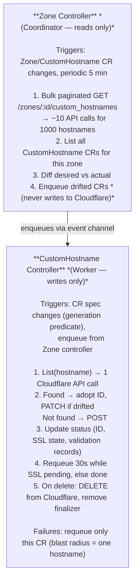

# cf-edge-operator Architecture

## Overview

cf-edge-operator manages Cloudflare for SaaS (custom hostnames, Origin SNI overrides) via Kubernetes CRDs. It deliberately excludes DNS record management, which belongs to external-dns or similar tools.

## CRDs

### Zone (`cf.cf-edge.io/v1alpha1`)
Represents a Cloudflare zone. Lives in the operator namespace. Holds zone ID and a reference to a secret containing the Cloudflare API token. All CustomHostname resources in app namespaces reference a Zone.

### CustomHostname (`cf.cf-edge.io/v1alpha1`)
Represents a Cloudflare custom hostname with origin server and optional SNI override. Lives in app namespaces. References a Zone cross-namespace.

## Controller Architecture: Coordinator / Worker Split

Two controllers with clearly separated responsibilities:



## Why This Split

**Zone as coordinator (bulk reader):**
- One paginated list call per zone per cycle regardless of how many hostnames exist
- Drift detection catches external deletions (Cloudflare dashboard, other tools)
- On operator restart, only Zone CRs are enqueued — not all 1000 CustomHostname CRs
- Zone reconcile failures are safe: no writes occurred, requeue the zone

**CustomHostname as worker (targeted writer):**
- Single CR → single API call: fast write latency (200-500ms) for individual changes
- Failure isolation: Cloudflare 500 on hostname #42 does not affect the other 999
- controller-runtime exponential backoff applies per CR natively
- Finalizer ensures Cloudflare deletion on CR delete, even across operator restarts

## State

State is distributed across two systems — no in-memory cache:

| What | Where |
|------|-------|
| Desired state | Kubernetes (CustomHostname CR spec) |
| Cloudflare hostname ID | Kubernetes (CustomHostname CR status.id) |
| SSL verification state | Kubernetes (CustomHostname CR status.ssl) |
| Actual state | Cloudflare API (source of truth for drift detection) |

`status.id` is a performance cache for `Get(id)` in the CustomHostname controller. It is validated against Cloudflare on every reconcile via `List(hostname)`, so a stale or missing ID is self-healing.

## Restart Behavior

On operator restart:
1. Zone CRs are enqueued (typically 1-5 zones)
2. Each Zone reconcile does one bulk list from Cloudflare
3. Only CustomHostname CRs with actual drift are enqueued
4. Spec-unchanged CRs are never individually reconciled

`GenerationChangedPredicate` is applied to the CustomHostname controller as an additional guard against spurious reconciles from status-only updates during normal operation.

## SSL Provisioning (Async)

Cloudflare SSL verification is asynchronous (minutes to hours). The CustomHostname controller handles this via:
- `status.ssl.status` reflects current Cloudflare SSL state
- `status.ssl.validationRecords` surfaces DCV tokens so operators can complete validation
- While `ssl.status != "active"`: `Ready=False`, requeue after 30s
- When `ssl.status == "active"`: `Ready=True`, no further requeue

## Cloudflare API Efficiency

| Operation | API calls |
|-----------|-----------|
| Drift detection (1000 hostnames) | ~10 (paginated, 100/page) |
| Single CR create/update | 1 List + 1 POST/PATCH |
| Single CR delete | 1 DELETE |
| Restart (1000 CRs, 5 zones) | 5 × ~10 = ~50 |

## Credential Flow

```
CustomHostname CR (app namespace)
  └─ zoneRef → Zone CR (operator namespace)
                 └─ credentialsRef → Secret (operator namespace)
                                      └─ apiToken → Cloudflare API
```

App namespaces never hold Cloudflare credentials.

## Delete Policy

The `--delete-policy` flag controls behavior when a CustomHostname CR is deleted:

- **`always`** (default): delete from Cloudflare by `status.id` regardless of current state. Treats 404 as success.
- **`own-only`**: look up the current Cloudflare state via `findByHostname` before deleting. Only deletes if the current CF ID matches `status.id`. If IDs differ or the hostname is not found, releases the finalizer without touching Cloudflare.

### When to use `own-only`

**Migration from external-dns:** During the transition period, external-dns and cf-edge-operator may both be active for the same zone. External-dns can delete and recreate a hostname (new CF ID), leaving `status.id` stale. If a CR is deleted during this window:

- `always`: tries to delete by stale ID → 404 → releases. The live hostname survives by accident.
- `own-only`: looks up current CF state, sees ID mismatch → releases without any CF API call. Explicitly safe.

**Recommended:** deploy cf-edge-operator with `--delete-policy=own-only` during any migration phase where another tool may concurrently manage the same CF zone.

See [docs/migration.md](migration.md) for the full migration guide.

## Observability

### Status fields

| Field | Purpose |
|-------|---------|
| `status.id` | CF custom hostname ID, used for updates and deletes |
| `status.ssl` | SSL state (status, expiresOn, validationRecords) |
| `status.createCount` | How many times this hostname was (re)created in CF. Values > 1 indicate external deletions. |
| `status.consecutiveErrors` | Consecutive reconcile failures. Resets to 0 on success. |

### Prometheus metrics

| Metric | Type | Description |
|--------|------|-------------|
| `cf_edge_operator_customhostname_creates_total` | counter | Successful CF POST calls |
| `cf_edge_operator_customhostname_updates_total` | counter | Drift corrections (PATCH) |
| `cf_edge_operator_customhostname_deletes_total` | counter | Successful CF DELETE calls |
| `cf_edge_operator_unhealthy_customhostnames` | gauge | CRs with `consecutiveErrors > 0` |
| `cf_edge_operator_zone_orphans{zone}` | gauge | CF hostnames with no corresponding CR |
| `cf_edge_operator_api_duration_seconds{operation}` | histogram | CF API call latency |
| `cf_edge_operator_api_errors_total` | counter | Total CF API errors |
| `cf_edge_operator_api_errors_by_code_total{operation,status_code}` | counter | CF API errors by operation and HTTP status |

Controller-runtime also exposes `controller_runtime_reconcile_total` and `controller_runtime_reconcile_time_seconds` per controller.

## Future Work

- **SSL provisioning duration metric** — time from CR creation to `ssl.status == active`. Requires `status.sslProvisioningStartedAt` field set on first create.
- **`--delete-policy` per-CR override** — allow spec-level override of the operator-wide delete policy.
- **CI integration tests** — end-to-end tests against a dedicated CF zone with real API credentials.
